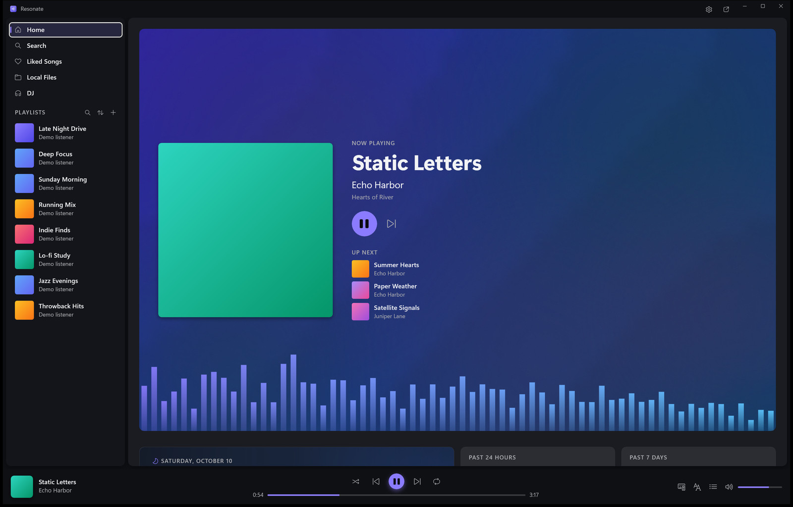
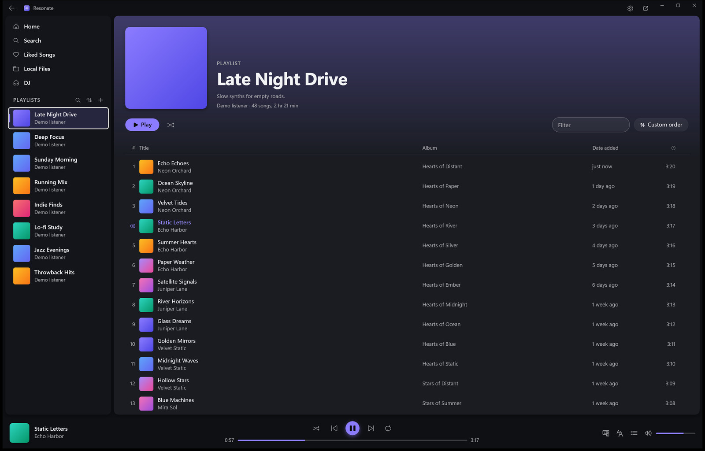
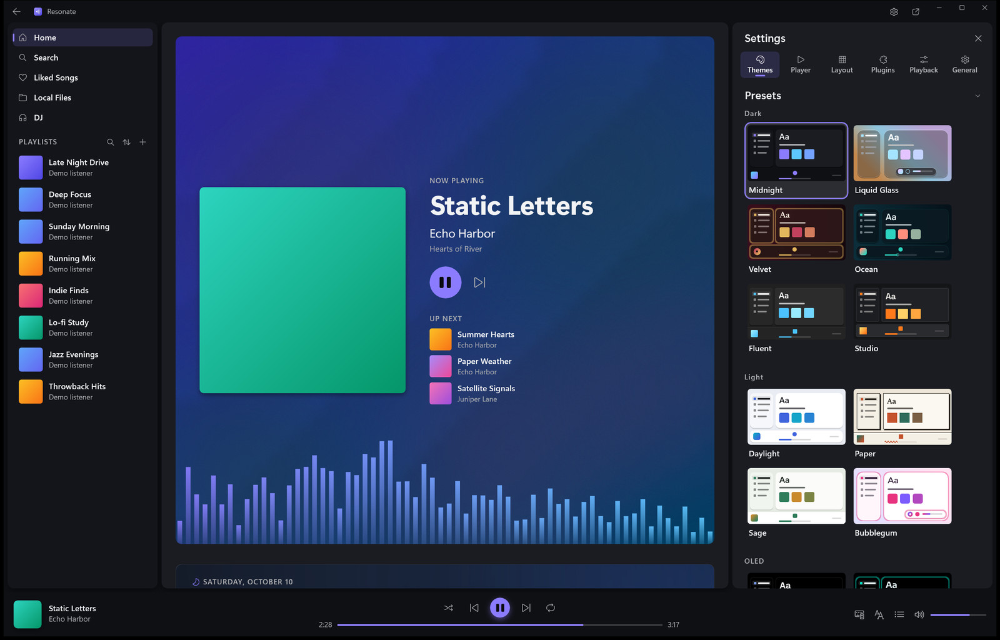
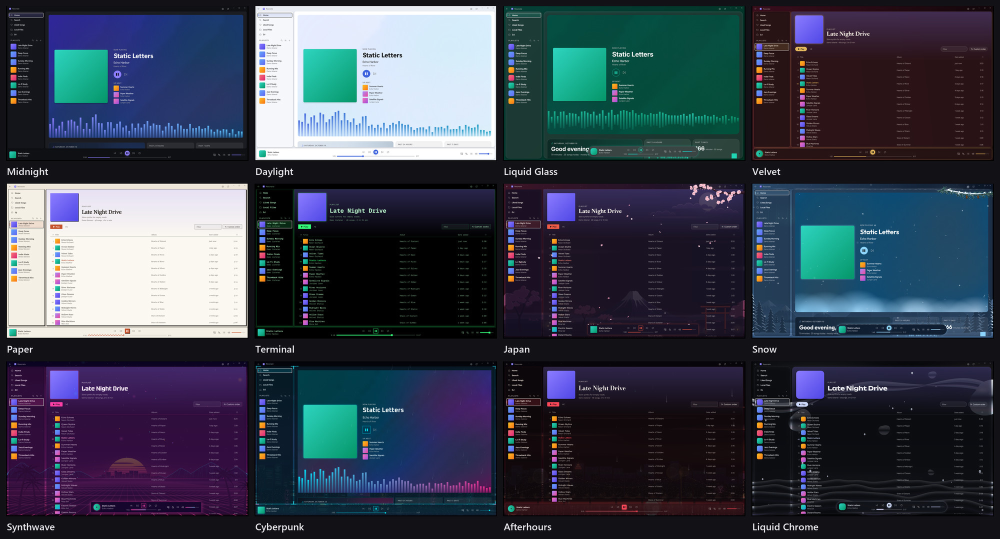
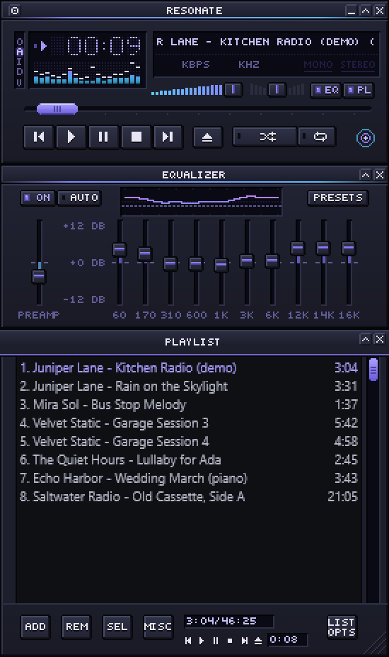

# Resonate

A fast, good-looking Windows app for Spotify. It opens in under a second,
runs at your monitor's full refresh rate and looks the way you want, while
Spotify's own app keeps playing every song in Lossless.

**[Download Resonate for Windows](https://github.com/livexibot/Resonate/releases/latest/download/Resonate-win-x64-Setup.exe)**
· [All versions](https://github.com/livexibot/Resonate/releases)

Windows may say it does not recognise the installer, since it is not
signed yet: choose **More info**, then **Run anyway**. Resonate updates
itself after that.

## What it does

- **Your Spotify library, without the wait.** Home, playlists, Liked Songs,
  search, artist and album pages, the queue and synced lyrics, with
  smooth scrolling and instant clicks.
- **Lossless sound.** The official Spotify app plays the music, hidden in
  the background. Resonate is the window you use.
- **Twenty looks and a full customizer.** Colours, light or dark,
  backgrounds, corners, fonts and where the player sits. The special looks
  have moving scenery and weather.
- **A Home that comes alive.** The playing song on a stage, your listening
  stats, your top artists and daily mixes, and Resonate's own DJ.
- **Extras you can turn on.** A Winamp player, a screensaver, smart
  playlists, an alarm, a sleep timer, media shortcuts and more, in
  Settings, Plugins.
- **Your own music files** in Local Files, beside your Spotify library.

| A playlist | Settings |
| --- | --- |
|  |  |

## Looks

Pick one in Settings, Themes, change any part of it, and save your own.

## Winamp

Use a Winamp 2 player in place of the player bar, or press Ctrl+M for a
mini player that stays on top, with Winamp's equalizer and playlist under
it. Add any classic `.wsz` skin you like.

 

## What you need

- Windows 10 or 11
- Spotify Premium
- The Spotify desktop app, signed in
- A free Spotify developer app of your own: Resonate's first screen walks
  you through it in about two minutes

## How it works

Resonate never plays Spotify's music itself. The Spotify app runs hidden
and plays everything in Lossless. Resonate controls it through Windows'
media controls (instant play, pause and skip) and Spotify's Web API (your
library, search and playlists).

Rather close the Spotify app? Choose "Spotify Web API only" in Settings,
Playback. Resonate then plays through Spotify's official web player,
hidden inside it, at 256 kbps instead of Lossless.

## More

- [Plugins](docs/plugins.md)
- [What changed in each version](CHANGELOG.md)

Resonate is an independent project for Spotify and is not affiliated with
Spotify.
